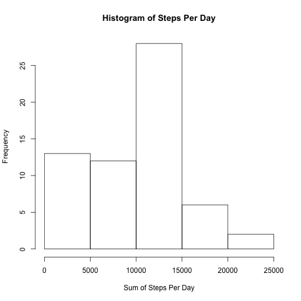
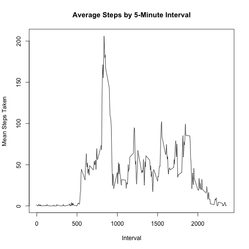
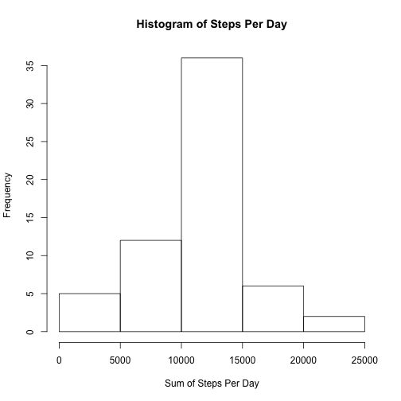
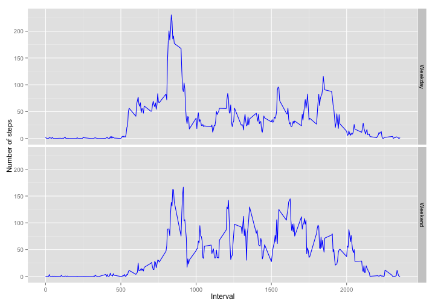

##Loading and Preprocessing the Data

```r
library(plyr)
library(dplyr)
library(xtable)
library(ggplot2)
setwd("~/Dropbox/Programming/ReproducibleResearch/PS1")
data<-read.csv("activity.csv")
```

##What is the mean total of steps taken per day?

1.  Calculate the total number of steps taken per day.

```r
dataByDay<-group_by(data, date)
totalSteps<-summarize(dataByDay, sum(steps, na.rm=TRUE))  
names(totalSteps)<-c("Date", "Total_Steps_Per_Day")
xt<-xtable(totalSteps)
print(xt, type = 'html')
```

<!-- html table generated in R 3.1.2 by xtable 1.7-4 package -->
<!-- Sat Mar 14 15:46:37 2015 -->
<table border=1>
<tr> <th>  </th> <th> Date </th> <th> Total_Steps_Per_Day </th>  </tr>
  <tr> <td align="right"> 1 </td> <td> 2012-10-01 </td> <td align="right">   0 </td> </tr>
  <tr> <td align="right"> 2 </td> <td> 2012-10-02 </td> <td align="right"> 126 </td> </tr>
  <tr> <td align="right"> 3 </td> <td> 2012-10-03 </td> <td align="right"> 11352 </td> </tr>
  <tr> <td align="right"> 4 </td> <td> 2012-10-04 </td> <td align="right"> 12116 </td> </tr>
  <tr> <td align="right"> 5 </td> <td> 2012-10-05 </td> <td align="right"> 13294 </td> </tr>
  <tr> <td align="right"> 6 </td> <td> 2012-10-06 </td> <td align="right"> 15420 </td> </tr>
  <tr> <td align="right"> 7 </td> <td> 2012-10-07 </td> <td align="right"> 11015 </td> </tr>
  <tr> <td align="right"> 8 </td> <td> 2012-10-08 </td> <td align="right">   0 </td> </tr>
  <tr> <td align="right"> 9 </td> <td> 2012-10-09 </td> <td align="right"> 12811 </td> </tr>
  <tr> <td align="right"> 10 </td> <td> 2012-10-10 </td> <td align="right"> 9900 </td> </tr>
  <tr> <td align="right"> 11 </td> <td> 2012-10-11 </td> <td align="right"> 10304 </td> </tr>
  <tr> <td align="right"> 12 </td> <td> 2012-10-12 </td> <td align="right"> 17382 </td> </tr>
  <tr> <td align="right"> 13 </td> <td> 2012-10-13 </td> <td align="right"> 12426 </td> </tr>
  <tr> <td align="right"> 14 </td> <td> 2012-10-14 </td> <td align="right"> 15098 </td> </tr>
  <tr> <td align="right"> 15 </td> <td> 2012-10-15 </td> <td align="right"> 10139 </td> </tr>
  <tr> <td align="right"> 16 </td> <td> 2012-10-16 </td> <td align="right"> 15084 </td> </tr>
  <tr> <td align="right"> 17 </td> <td> 2012-10-17 </td> <td align="right"> 13452 </td> </tr>
  <tr> <td align="right"> 18 </td> <td> 2012-10-18 </td> <td align="right"> 10056 </td> </tr>
  <tr> <td align="right"> 19 </td> <td> 2012-10-19 </td> <td align="right"> 11829 </td> </tr>
  <tr> <td align="right"> 20 </td> <td> 2012-10-20 </td> <td align="right"> 10395 </td> </tr>
  <tr> <td align="right"> 21 </td> <td> 2012-10-21 </td> <td align="right"> 8821 </td> </tr>
  <tr> <td align="right"> 22 </td> <td> 2012-10-22 </td> <td align="right"> 13460 </td> </tr>
  <tr> <td align="right"> 23 </td> <td> 2012-10-23 </td> <td align="right"> 8918 </td> </tr>
  <tr> <td align="right"> 24 </td> <td> 2012-10-24 </td> <td align="right"> 8355 </td> </tr>
  <tr> <td align="right"> 25 </td> <td> 2012-10-25 </td> <td align="right"> 2492 </td> </tr>
  <tr> <td align="right"> 26 </td> <td> 2012-10-26 </td> <td align="right"> 6778 </td> </tr>
  <tr> <td align="right"> 27 </td> <td> 2012-10-27 </td> <td align="right"> 10119 </td> </tr>
  <tr> <td align="right"> 28 </td> <td> 2012-10-28 </td> <td align="right"> 11458 </td> </tr>
  <tr> <td align="right"> 29 </td> <td> 2012-10-29 </td> <td align="right"> 5018 </td> </tr>
  <tr> <td align="right"> 30 </td> <td> 2012-10-30 </td> <td align="right"> 9819 </td> </tr>
  <tr> <td align="right"> 31 </td> <td> 2012-10-31 </td> <td align="right"> 15414 </td> </tr>
  <tr> <td align="right"> 32 </td> <td> 2012-11-01 </td> <td align="right">   0 </td> </tr>
  <tr> <td align="right"> 33 </td> <td> 2012-11-02 </td> <td align="right"> 10600 </td> </tr>
  <tr> <td align="right"> 34 </td> <td> 2012-11-03 </td> <td align="right"> 10571 </td> </tr>
  <tr> <td align="right"> 35 </td> <td> 2012-11-04 </td> <td align="right">   0 </td> </tr>
  <tr> <td align="right"> 36 </td> <td> 2012-11-05 </td> <td align="right"> 10439 </td> </tr>
  <tr> <td align="right"> 37 </td> <td> 2012-11-06 </td> <td align="right"> 8334 </td> </tr>
  <tr> <td align="right"> 38 </td> <td> 2012-11-07 </td> <td align="right"> 12883 </td> </tr>
  <tr> <td align="right"> 39 </td> <td> 2012-11-08 </td> <td align="right"> 3219 </td> </tr>
  <tr> <td align="right"> 40 </td> <td> 2012-11-09 </td> <td align="right">   0 </td> </tr>
  <tr> <td align="right"> 41 </td> <td> 2012-11-10 </td> <td align="right">   0 </td> </tr>
  <tr> <td align="right"> 42 </td> <td> 2012-11-11 </td> <td align="right"> 12608 </td> </tr>
  <tr> <td align="right"> 43 </td> <td> 2012-11-12 </td> <td align="right"> 10765 </td> </tr>
  <tr> <td align="right"> 44 </td> <td> 2012-11-13 </td> <td align="right"> 7336 </td> </tr>
  <tr> <td align="right"> 45 </td> <td> 2012-11-14 </td> <td align="right">   0 </td> </tr>
  <tr> <td align="right"> 46 </td> <td> 2012-11-15 </td> <td align="right">  41 </td> </tr>
  <tr> <td align="right"> 47 </td> <td> 2012-11-16 </td> <td align="right"> 5441 </td> </tr>
  <tr> <td align="right"> 48 </td> <td> 2012-11-17 </td> <td align="right"> 14339 </td> </tr>
  <tr> <td align="right"> 49 </td> <td> 2012-11-18 </td> <td align="right"> 15110 </td> </tr>
  <tr> <td align="right"> 50 </td> <td> 2012-11-19 </td> <td align="right"> 8841 </td> </tr>
  <tr> <td align="right"> 51 </td> <td> 2012-11-20 </td> <td align="right"> 4472 </td> </tr>
  <tr> <td align="right"> 52 </td> <td> 2012-11-21 </td> <td align="right"> 12787 </td> </tr>
  <tr> <td align="right"> 53 </td> <td> 2012-11-22 </td> <td align="right"> 20427 </td> </tr>
  <tr> <td align="right"> 54 </td> <td> 2012-11-23 </td> <td align="right"> 21194 </td> </tr>
  <tr> <td align="right"> 55 </td> <td> 2012-11-24 </td> <td align="right"> 14478 </td> </tr>
  <tr> <td align="right"> 56 </td> <td> 2012-11-25 </td> <td align="right"> 11834 </td> </tr>
  <tr> <td align="right"> 57 </td> <td> 2012-11-26 </td> <td align="right"> 11162 </td> </tr>
  <tr> <td align="right"> 58 </td> <td> 2012-11-27 </td> <td align="right"> 13646 </td> </tr>
  <tr> <td align="right"> 59 </td> <td> 2012-11-28 </td> <td align="right"> 10183 </td> </tr>
  <tr> <td align="right"> 60 </td> <td> 2012-11-29 </td> <td align="right"> 7047 </td> </tr>
  <tr> <td align="right"> 61 </td> <td> 2012-11-30 </td> <td align="right">   0 </td> </tr>
   </table>


2.  Make a histogram of the total number of steps taken each day

```r
hist(totalSteps$Total_Steps_Per_Day, main = "Histogram of Steps Per Day", xlab="Sum of Steps Per Day")
```

 

3.  Calculate and report the mean and median of the total number of steps taken per day

```r
mean(totalSteps$Total_Steps_Per_Day)
```

```
## [1] 9354.23
```

```r
median(totalSteps$Total_Steps_Per_Day)
```

```
## [1] 10395
```

##What is the average daily activity pattern?

1.  Make a time series plot (i.e. type = "l") of the 5-minute interval (x-axis) and the average number of steps taken, averaged across all days (y-axis)

```r
dataByInterval <- group_by(data, interval)
meanSteps<-summarize(dataByInterval, mean(steps, na.rm = TRUE))
names(meanSteps) = c("Interval", "Mean_Steps")
plot(Mean_Steps ~ Interval, data = meanSteps, type = "l", ylab = "Mean Steps Taken", main = "Average Steps by 5-Minute Interval")
```

 

2.  Which 5-minute interval, on average across all the days in the dataset, contains the maximum number of steps?

```r
meanStepsSorted<-arrange(meanSteps, -Mean_Steps)
meanStepsSorted[1,]
```

```
## Source: local data frame [1 x 2]
## 
##   Interval Mean_Steps
## 1      835   206.1698
```
The **835th interval** contains the maximum number of steps averaged across all days in the dataset.

##Imputing missing values

Note that there are a number of days/intervals where there are missing values (coded as NA). The presence of missing days may introduce bias into some calculations or summaries of the data.

1.  Calculate and report the total number of missing values in the dataset (i.e. the total number of rows with NAs)

```r
sum(is.na(data))
```

```
## [1] 2304
```
There are **2304 missing values*** in the dataset.

2.  Devise a strategy for filling in all of the missing values in the dataset. The strategy does not need to be sophisticated. For example, you could use the mean/median for that day, or the mean for that 5-minute interval, etc.  
I impute missing values based on the mean steps taken during each five minute interval.

3.  Create a new dataset that is equal to the original dataset but with the missing data filled in.

```r
impute.mean <- function(x) replace(x, is.na(x), mean(x, na.rm = TRUE))
dat2 <- ddply(data, ~ interval, transform, steps = impute.mean(steps))
sum(is.na(dat2))
```

```
## [1] 0
```

4.  Make a histogram of the total number of steps taken each day and calculate and report the mean and median total number of steps taken per day. Do these values differ from the estimates from the first part of the assignment? What is the impact of imputing missing data on the estimates of the total daily number of steps?

```r
dataByDayI<-group_by(dat2, date)
totalStepsI<-summarize(dataByDayI, sum(steps))  
names(totalStepsI)<-c("Date", "Total_Steps_Per_Day")
hist(totalStepsI$Total_Steps_Per_Day, main = "Histogram of Steps Per Day", xlab="Sum of Steps Per Day")
```

 

```r
mean(totalStepsI$Total_Steps_Per_Day)
```

```
## [1] 10766.19
```

```r
median(totalStepsI$Total_Steps_Per_Day)
```

```
## [1] 10766.19
```
The distribution of the data now appears far more Gaussian.  When estimated based on the imputed values, the mean is equal to the median, whereas before the mean was less than the median, reflecting the left skew of the data.

##Are there differences in activity patterns between weekdays and weekends?

For this part the weekdays() function may be of some help here. Use the dataset with the filled-in missing values for this part.

1.  Create a new factor variable in the dataset with two levels – “weekday” and “weekend” indicating whether a given date is a weekday or weekend day.

```r
dat2$date<-as.Date(dat2$date)
dat2$weekdays<-weekdays(dat2$date)
table(dat2$weekdays)
```

```
## 
##    Friday    Monday  Saturday    Sunday  Thursday   Tuesday Wednesday 
##      2592      2592      2304      2304      2592      2592      2592
```

```r
dat2$dayType[dat2$weekdays == "Monday" | dat2$weekdays == "Tuesday" | dat2$weekdays == "Wednesday" | dat2$weekdays == "Thursday" | dat2$weekdays == "Friday"]<-"Weekday"
dat2$dayType[dat2$weekdays == "Saturday" | dat2$weekdays == "Sunday"]<-"Weekend"
dat2$dayType<-as.factor(dat2$dayType)
```

2.  Make a panel plot containing a time series plot (i.e. type = "l") of the 5-minute interval (x-axis) and the average number of steps taken, averaged across all weekday days or weekend days (y-axis). See the README file in the GitHub repository to see an example of what this plot should look like using simulated data.

```r
weekdayGroup<-group_by(dat2, dayType, interval)
weekdayGroupSummary<-summarize(weekdayGroup, mean(steps))
names(weekdayGroupSummary)<-c("dayType", "interval", "steps")
plot<-ggplot(weekdayGroupSummary, aes(x=interval, y=steps)) + facet_grid(dayType~.) + geom_line(color = "blue") + xlab("Interval") + ylab("Number of steps") 
plot
```

 


